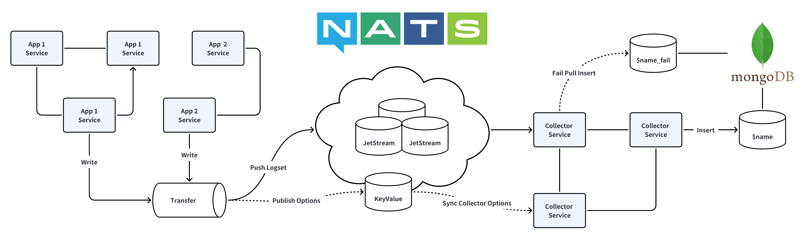

# Weplanx Collector

[](https://github.com/weplanx/collector/actions/workflows/release.yml)
[](https://github.com/weplanx/collector/actions/workflows/testing.yml)
[](https://github.com/weplanx/collector/releases)
[](https://coveralls.io/github/weplanx/collector)
[](https://github.com/weplanx/collector)
[](https://goreportcard.com/report/github.com/weplanx/collector)
[](https://raw.githubusercontent.com/weplanx/collector/main/LICENSE)

Lightly queue stream transfer and distributed logset collector

## Pre-requisites

- A Nats cluster with JetStream enabled.
- A MongoDB, preferably with a version greater than 5.0, so that time series collections can be used.
- Services can only work together under the same namespace.

> The same namespace defines the database name for mongodb, `${namespace}_logs` for nats
> key-value, `${namespace}:logs:${key}` for nats stream

## Collector

The collector service for subscribing to the stream queue and then writing to the log collection.



The collection needs to be managed manually and created with the name ${key}_logs.

> If the mongodb version is greater than 5.0, recommended time series collection, the transfer contains metadata field
> will be set to the time series collection metaField.

The main container images are:

- ghcr.io/weplanx/collector:latest
- ccr.ccs.tencentyun.com/weplanx/collector:latest

The case will deploy the orchestration using Kubernetes, replicating the deployment (with modifications as needed).

```yaml
apiVersion: apps/v1
kind: Deployment
metadata:
  name: collector
spec:
  selector:
    matchLabels:
      app: collector
  template:
    metadata:
      labels:
        app: collector
    spec:
      containers:
        - image: ccr.ccs.tencentyun.com/weplanx/collector:v1.10.0
          imagePullPolicy: Always
          name: collector
          env:
            - name: MODE
              value: release
            - name: NAMESPACE
              value: <*** your namespace ***>
            - name: NATS_HOSTS
              value: <*** your nats hosts ***>
            - name: NATS_NKEY
              value: <*** your nats nkey***>
            - name: DATABASE_URL
              value: <*** your mongodb url ***>
            - name: DATABASE_NAME
              value: <*** your mongodb name ***>
```

The environment variable of the service.

| Parameter       | Description                                   |
|-----------------|-----------------------------------------------|
| `MODE`          | Log level is production when set to `release` |
| `NAMESPACE`     | Namespace for collector and transfer          |
| `NATS_HOSTS`    | Nats connection address                       |
| `NATS_NKEY`     | Nats nkey auth                                |
| `DATABASE_URL`  | MongoDB url                                   |
| `DATABASE_NAME` | MongoDB database name                         |

## Transfer

client for managing configuration, data transfer, and scheduling distribution collectors.

```shell
go get github.com/weplanx/collector
```

A simple quick start case

```text
// Create the nats client and then create the jetstream context
if js, err = nc.JetStream(nats.PublishAsyncMaxPending(256)); err != nil {
panic(err)
}

// Create the transfer client
if client, err = transfer.New(
transfer.SetNamespace("beta"),
transfer.SetJetStream(js),
); err != nil {
panic(err)
}

// Set logger
err := client.Set(context.TODO(), transfer.StreamOption{
Key:         "system",
Description: "system beta",
})

// Get logger
result, err := client.Get("system")

// Publish log data
err := client.Publish(context.TODO(), "system", transfer.Payload{
    Timestamp: time.Now(),
    Data: map[string]interface{}{
        "metadata": map[string]interface{}{
            "method":    method,
            "path":      string(c.Request.Path()),
            "user_id":   userId,
            "client_ip": c.ClientIP(),
        },
        "params":     string(c.Request.QueryString()),
        "body":       c.Request.Body(),
        "status":     c.Response.StatusCode(),
        "user_agent": string(c.Request.Header.UserAgent()),
    },
    XData: map[string]interface{}{},
})

// Remove logger
err := client.Remove("system")
```

## License

[BSD-3-Clause License](https://github.com/weplanx/collector/blob/main/LICENSE)
