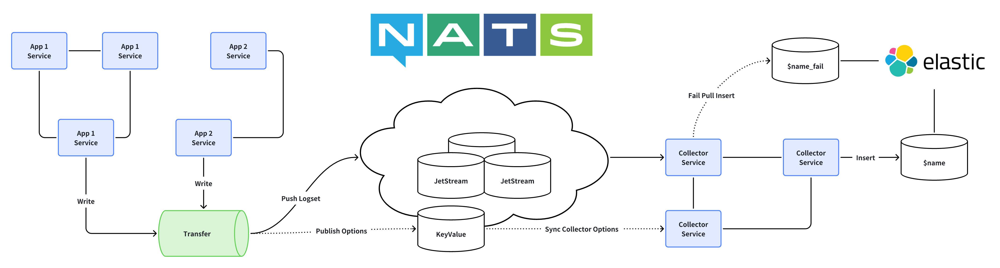

# Weplanx Collector

[](https://github.com/weplanx/collector/actions/workflows/release.yml)
[](https://github.com/weplanx/collector/actions/workflows/testing.yml)
[](https://github.com/weplanx/collector/releases)
[](https://coveralls.io/github/weplanx/collector)
[](https://github.com/weplanx/collector)
[](https://goreportcard.com/report/github.com/weplanx/collector)
[](https://raw.githubusercontent.com/weplanx/collector/main/LICENSE)

Distribution lightly queue stream collect service

## Pre-requisite

- Nats cluster needs to enable JetStream
- An Elasticsearch node, preferably a cluster
- Services and applications should work together the same nats tenant



## Deploy

A collector service that subscribes to stream queues and then writes to data.

The main container image is:

- ghcr.io/weplanx/collector:latest

The case will use Kubernetes deployment orchestration, replicate deployment (modify as needed).

```yaml
apiVersion: apps/v1
kind: Deployment
metadata:
  name: collector
spec:
  selector:
    matchLabels:
      app: collector
  template:
    metadata:
      labels:
        app: collector
    spec:
      containers:
        - image: ghcr.io/weplanx/collector:latest
          imagePullPolicy: Always
          name: collector
```

## Client

The client for managing collector configuration, data transmission, and dispatching, installed in the application:

```shell
go get github.com/weplanx/collector/v2
```

### Initialize

```go
// Create the nats client and then create the jetstream context
if js, err = nc.JetStream(nats.PublishAsyncMaxPending(256)); err != nil {
    panic(err)
}

// Create the transfer client
if x, err = client.New(js); err != nil {
    panic(err)
}
```

### Set

```go
err := x.Set(context.TODO(), client.StreamOption{
    Key:         "beta",
    Description: "beta example",
})
```

### Update 

```go
err := x.Update(context.TODO(), client.StreamOption{
    Key:         "beta",
    Description: "beta example 123",
})
```

### Get Info

```go
result, err := client.Get("beta")
```

### Publish

```go
err := x.Publish(context.TODO(), "beta", client.Payload{
    Timestamp: time.Now(),
    Data: map[string]interface{}{
        "metadata": map[string]interface{}{
            "method":    method,
            "path":      string(c.Request.Path()),
            "user_id":   userId,
            "client_ip": c.ClientIP(),
        },
        "params":     string(c.Request.QueryString()),
        "body":       c.Request.Body(),
        "status":     c.Response.StatusCode(),
        "user_agent": string(c.Request.Header.UserAgent()),
    },
    XData: map[string]interface{}{},
})
```

### Remove

```go
err := x.Remove("beta")
```

## License

[BSD-3-Clause License](https://github.com/weplanx/collector/blob/main/LICENSE)
